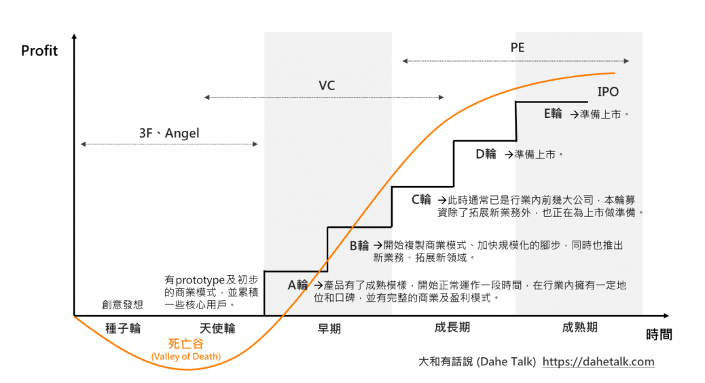

> 一级市场和二级市场的区别：

> vc(venture captial)、pe和战略投资：

> (ipo 到上市后的定价机制)
审批制、核准制和注册制：

> 股权和债券的区别

> A、B、C、D......轮融资：

> 估值到底怎么个估法？：

学习资料：

- [可汗学院公开课：风险投资与金融市场](http://open.163.com/special/Khan/venturecapitalandcapitamarket.html)