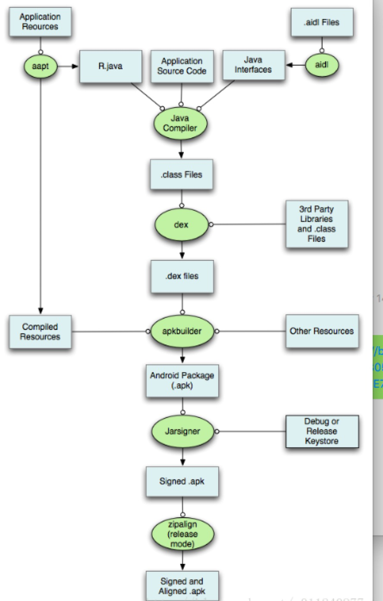
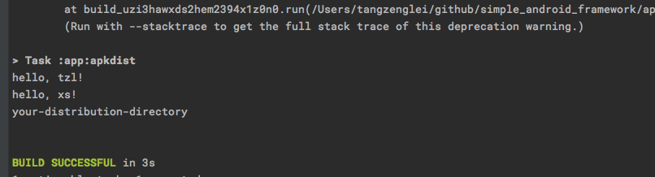
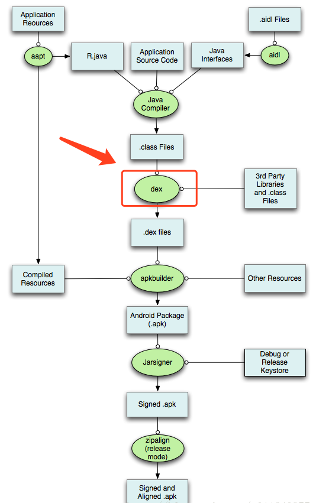

# Gradle 概览





### Gradle 初体验


## 什么是 Gradle

Gradle 是一个强大的构建工具，它集成了 Ant 基于任务和构建的特性，和 ApacheIvy 强大的依赖管理功能。最重要的是开发者可以通过 Gradle 标准自定义构建插件，这一点远远优于 maven.

### 执行时序


先从我们最熟悉的开始，当我们新建一个 Android 项目的时候，系统会给我们自动生成：

 - setting.gradle
 - Project build.gradle
 - module build.gradle
 
 
 我们称整个项目为 Project,单个项目 为 module，每个项目都有自己的build.gradle 文件。
 
 
好的，那么接下来我们看看 这几个文件中都写了啥，参考：[Android DSL](http://google.github.io/android-gradle-dsl/current/index.html)


### 自定义 Gradle Plugin 


[](https://docs.gradle.org/current/userguide/custom_plugins.html)


一般有三种方式：

- 直接在 Gradle 脚本中；
- buildSrc
- maven


### 自定义 Gradle Task

好的，接下来通过自定义 Task 来了解系统的原理和完成一些实例。常见的 Gradle Plugin 作为自定义 Task 的一种载体存在。





R2


### Gradle 


[Project](https://docs.gradle.org/current/javadoc/org/gradle/api/Project.html)

[Task](https://docs.gradle.org/current/javadoc/org/gradle/api/Task.html)

transfromApi


### Groovy


Groovy 作为 一种 JVM 语言，比 Java 拥有更好的动态性和便捷性。


- [Groovy 官方文档](http://docs.groovy-lang.org/)
- [Groovy 上手指南](https://www.w3cschool.cn/groovy/groovy_methods.html)


#### 配置环境


[下载安装路径](http://groovy-lang.org/download.html#osinstall)

> Mac 上直接使用：
```
brew install groovy
```


验证：


```
groovy --version
groovy -e "println 'Hello World!'"
```


#### 语法学习

回顾我们学习 Java 的历程，我们从：


- 成员变量
- 运算
- 方法
- 构造器
- 类
- 集合 io 相关操作
- 新增特性(语言糖 syntactic sugar):闭包[函数传递]


慢慢了解 Java 这门语言的大致使用。下面我们也从这几个方面熟悉 Groovy 的语法。


#### Debug 技巧


### ASM/Javassist/ReDex 代码插桩


 
 
 
 
 
 
 
> 感兴趣的童鞋可以研究下：
 
 - [Gradle 学习概览](https://blog.csdn.net/singwhatiwanna/article/details/78797506)
 
-  [ASM 实战--饿了么巴掌](http://www.wangyuwei.me/archives/)
 
- [Gradle 自定义插件](https://blog.csdn.net/eclipsexys/article/details/50973205)

- [Gradle Plugin 练手项目](https://github.com/JeasonWong/R2Assistant)

- [Gradle Plugin 练手项目二](https://github.com/android-notes/TinyPngPlugin) 
 
 
> **感兴趣的同学可以看下 Gradle 源码**
 
-  [groovy-android-gradle-plugin](https://github.com/groovy/groovy-android-gradle-plugin)
 
-  [Gradle 源码](https://android.googlesource.com/platform/tools/base/+/gradle_3.1.2)


 


